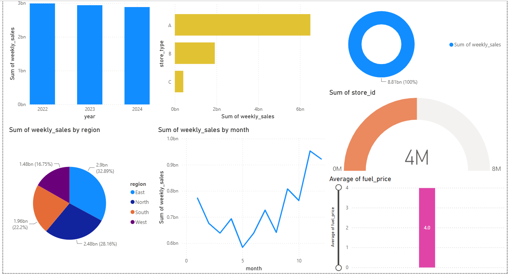

<h1 align="center">📊 Exploratory Data Analysis on Superstore Dataset</h1>

## 🛠️ Technology Stack

 
## ⚙️ Analysis Workflow

| Step | Description |
|------|-------------|
| 1️⃣ Data Exploration | Loaded and explored the Superstore dataset. |
| 2️⃣ Descriptive Statistics | Generated statistical summaries for numerical features. |
| 3️⃣ Correlation Analysis | Examined relationships between key variables. |
| 4️⃣ SQL Business Queries | Executed SQL queries to answer business questions. |
| 5️⃣ Dashboard Preparation | Prepared datasets and visualizations for reporting. |

## 📸 Dashboard Preview

The following dashboard was developed in **Power BI** to visualize key business metrics and support data-driven decision-making.

    

## 📊 Business Insights

| Analysis | Outcome |
|----------|---------|
| 🌍 Region-wise Sales | Compared sales performance across different regions. |
| 📦 Category Performance | Identified high-performing product categories. |
| 💰 Discount vs Profit | Evaluated the impact of discounts on profitability. |
| 👥 Customer Segments | Analyzed purchasing behavior across customer segments. |

## 📦 Project Deliverables

| Deliverable | Description |
|-------------|-------------|
| 📓 EDA Notebook | Complete exploratory data analysis workflow |
| 🛢️ SQL Queries | Business-focused SQL scripts |
| 📊 Visualizations | Charts and analytical graphs |
| 📑 Documentation | Project README and supporting materials |

## 💡 Skills Demonstrated

- Data Exploration
- Exploratory Data Analysis (EDA)
- Data Visualization
- SQL Query Writing
- Statistical Analysis
- Business Intelligence
- Problem Solving
- Technical Documentation