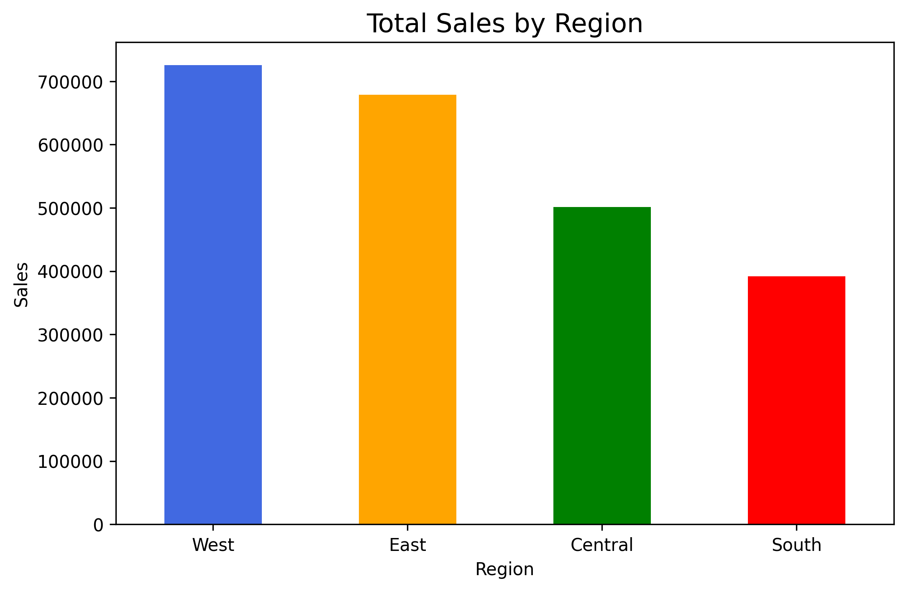
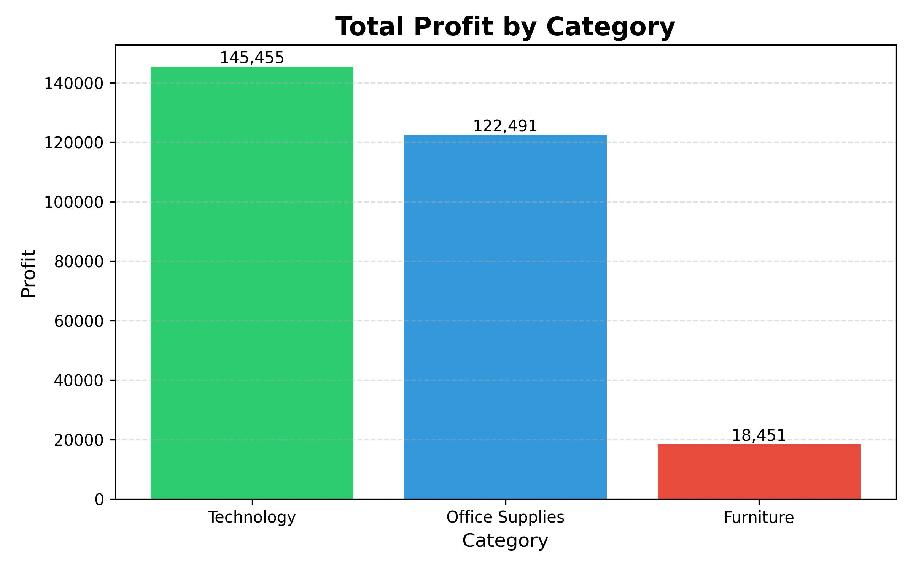

<h1 align="center">📊 Superstore Sales Data Analysis</h1>

## 📌 Project Overview

This project analyzes the Sample Superstore dataset using Python. The objective is to identify sales trends, profit patterns, customer behavior, regional performance, and business insights through Exploratory Data Analysis (EDA), visualization, and statistical testing.

--- 

## 🎯 Objectives

- Perform data cleaning and preprocessing
- Conduct Exploratory Data Analysis (EDA)
- Create meaningful visualizations
- Discover business insights
- Validate findings using hypothesis testing
- Present results through a professional report and presentation

---

## 🛠️ Tools & Technologies

- Python
- Pandas
- NumPy
- Matplotlib
- Seaborn
- SciPy
- VS Code
- Microsoft PowerPoint

---

## 📂 Dataset Information

| Attribute | Value |
|-----------|-------|
| Dataset | Sample Superstore |
| Records | 9,994 |
| Features | 21 |
| File Format | Excel (.xlsx) |
---

## 📈 Analysis & Visualizations

| Visualization | Purpose |
|--------------|---------|
| 🌍 Sales by Region | Compare regional sales performance |
| 💰 Profit by Category | Evaluate category profitability |
| 👥 Sales by Segment | Analyze customer segments |
| 📅 Monthly Sales Trend | Identify seasonal trends |
| 🏆 Top Products | Rank products by sales |
| 👤 Top Customers | Identify valuable customers |
| 🗺️ Top States | Compare state-wise sales |
| 🚚 Ship Mode Analysis | Analyze shipping preferences |
| 💸 Discount vs Profit | Study pricing impact |
| 🔥 Correlation Heatmap | Identify feature relationships |

---
## 📊 Business Insights

| Insight | Observation |
|---------|-------------|
| 🌍 Regional Performance | West region recorded the highest sales. |
| 💻 Product Category | Technology generated the highest profit. |
| 👥 Customer Segment | Consumer segment contributed the highest sales. |
| 🚚 Shipping Mode | Standard Class was the most frequently used shipping mode. |
| 🗺️ State Performance | California recorded the highest sales. |
| 🏆 Top Customer | Sean Miller generated the highest revenue. |
| 📦 Best-selling Product | Canon imageCLASS 2200 Advanced Copier led sales. |
| 💸 Discount Analysis | Higher discounts generally reduced profitability. |
---

## 📉 Hypothesis Testing

A two-sample Welch's t-test was performed to compare the average profit between Technology and Furniture categories.

Result:
- Null hypothesis rejected.
- Technology products generated significantly higher profit than Furniture products.

---

## 📁 Project Structure

```
Data analytics Task 4
│
├── Data
│   └── superstore_cleaned.xlsx
│
├── image
│   ├── sales_by_region.png
│   ├── profit_by_category.png
│   ├── monthly_sales_trend.png
│   ├── discount_vs_profit.png
│   └── ...
│
├── reports
│   ├── Project_Summary.docx
│   └── Superstore Analysis.pptx
│
├── source code
│   └── analysis.py
│
└── README.md
```

## 📸 Sample Visualizations

### Sales by Region

<p align="center">

</p>

---

### Profit by Category

<p align="center">

</p>
---

## 🚀 How to Run

1. Clone the repository

```
git clone <repository-link>
```

2. Install dependencies

```
pip install pandas numpy matplotlib seaborn scipy openpyxl
```

3. Run

```
python "source code/analysis.py"
```

---
# 👨‍💻 Author

**Aayush Mhaiskar**

🎓 B.Tech Computer Science & Engineering

📊 Data Analytics | Python | SQL | Power BI | Streamlit

🌐 GitHub: https://github.com/aayushjain2006
💼 LinkedIn: https://www.linkedin.com/in/aayush-mhaiskar-489a44236/

📧 Email: aayushmhaiskar2006@gmail.com